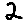
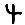
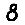
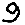

# AI_Digits-0-9_Database
Inside the `data.zip` file, there are 10 folders, one for each digit and in them 500 images from each digit,
also there are the files `xs.npy`, `ys.npy`, `xt.npy`, `yt.npy` - those files are training-sets, and testing-sets of the images, but in the NumPy array format.

`xs.py` & `ys.pt` are the training sets, they are suffled.
`xt.py` & `yt.pt` are the testing sets, they arn't shuffled.

## Image in the database
Each image in the database has 25x25 pixels, and the're single colored, with color range [0-255]

# examples

  
  
  
  

